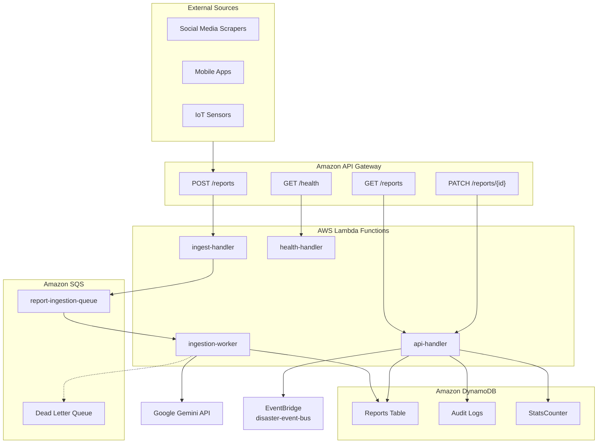
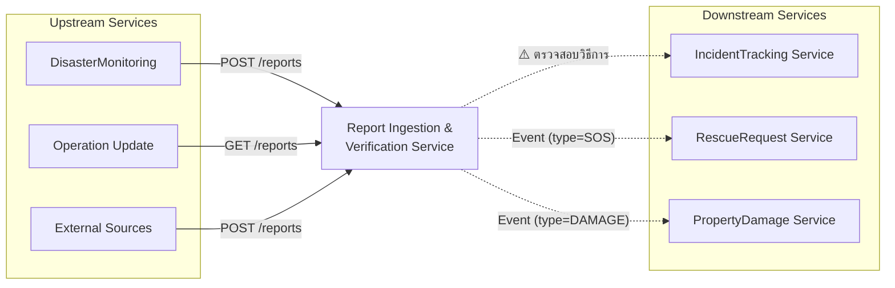

# Proposal Fix v4 — รายการปัญหาที่ยังต้องแก้ไข

> **อัปเดตล่าสุด**: 2026-03-20
>
> เอกสารนี้แสดงเฉพาะ **ปัญหาที่ยังไม่แก้ไข** ใน `reportingestion_proposal.txt`
> รายการที่แก้ไขแล้วถูกลบออกเพื่อความกระชับ

---

## 🔴 ปัญหาที่ต้องแก้ไขใน Proposal (3 ข้อ)

### 1. Amazon Comprehend ยังหลงเหลืออยู่ 4 จุด

**สถานะ**: ❌ ยังไม่แก้

ถึงแม้บรรทัดที่ 7-8 จะแก้เป็น "Google Gemini API" แล้ว แต่ยังมี **Amazon Comprehend** หลงเหลืออยู่ในตำแหน่งเหล่านี้:

| บรรทัด | เนื้อหา | ต้องแก้เป็น |
|--------|---------|-------------|
| ~729 | `"-Amazon Comprehend"` | `"-Google Gemini API"` |
| ~730 | `"บริการ AI สำหรับวิเคราะห์ข้อความ (NLP) เพื่อหา Keywords, Sentiment, และประเมินค่าความน่าเชื่อถือ (Trust Score)"` | `"บริการ AI ภายนอก (Google Gemini API) สำหรับวิเคราะห์ข้อความเพื่อประเมินความน่าเชื่อถือ (Trust Scoring) และจำแนกหมวดหมู่เหตุการณ์"` |
| ~740 | `"...โดยมีการเรียกใช้ Amazon Comprehend เพื่อวิเคราะห์..."` | `"...โดยมีการเรียกใช้ Google Gemini API เพื่อวิเคราะห์..."` |
| ~825 | `"5.Amazon Comprehend (or Internal AI Logic)"` | `"5.Google Gemini API (External AI Service)"` |

**เหตุผลที่ต้องแก้**: Amazon Comprehend **ใช้ไม่ได้**ใน AWS Learner Lab และ Implementation จริงใช้ Google Gemini API

---

### 2. Service Architecture Diagram หายไป

**สถานะ**: ❌ ยังไม่แก้

มี 2 ส่วนที่ต้องเพิ่ม Diagram:

**ส่วนที่ 1 - Service Architecture (บรรทัด ~714-715):**
```
1.ภาพแสดงการทำงานของแต่ละ Function

// Picture Will be shown here   ← มีแค่ placeholder
```

**ส่วนที่ 2 - Service Interaction (บรรทัด ~747-748):**
```
1.ภาพ Diagram 
-(คำอธิบายสำหรับการวาด)   ← มีแค่คำอธิบาย ไม่มีรูปจริง
```

**Diagram ที่แนะนำ** (Mermaid format):

#### Internal Architecture Diagram


#### Service Interaction Diagram


---

### 3. ai_analysis_tags ซ้ำ 2 ครั้งในตาราง Service Data

**สถานะ**: ❌ ยังไม่แก้

**ตำแหน่ง**:
- บรรทัด ~677: `ai_analysis_tagsList/ArrayNoป้ายกำกับที่ AI ตรวจจับได้ (ใช้ช่วย Search/Filter)["FIRE", "URGENT", "SMOKE"]`
- บรรทัด ~690: `ai_analysis_tagsList/ArrayNoป้ายกำกับที่ AI ตรวจจับได้["FIRE", "SMOKE"]`

**ต้องแก้**: ลบบรรทัด ~690 ออก (เป็น duplicate)

---

## 🟠 ปัญหาการเชื่อมต่อกับ Service ของเพื่อน (ต้องตรวจสอบร่วมกัน)

### 4. Incident Tracking Service — วิธีการส่งข้อมูลไม่ชัดเจน

**สถานะ**: ⚠️ ต้องตรวจสอบกับเพื่อน

**Proposal ของคุณระบุ**:
- Message Contract #1: ส่ง `ReportVerifiedEvent` ผ่าน EventBridge
- Consumer: Incident Tracking Service

**แต่ Incident Tracking Service proposal (`incidenttrackingservice.txt`) ระบุ**:
- API Contract #1: `POST /incidents` — รับข้อมูลผ่าน **HTTP API** (Synchronous)
- Base URL: `https://incident-service.krittamark.com/api/v1`
- ต้องส่ง Headers: `Authorization: Bearer [TOKEN]`, `X-IncidentTNX-Id: [UUID]`

**คำถามที่ต้องถามเพื่อน**:
1. Incident Service จะ **subscribe EventBridge** หรือต้อง **เรียก HTTP POST** โดยตรง?
2. ถ้า subscribe EventBridge → ใช้ Rule อะไร? Detail-Type อะไร?
3. ถ้าต้องเรียก HTTP → ต้องเพิ่ม HTTP Client ใน implementation

---

### 5. Location Format ไม่ตรงกัน

**สถานะ**: ⚠️ ต้องตรวจสอบกับเพื่อน

| ส่วน | Format ปัจจุบัน |
|------|----------------|
| **คุณ publish** (ReportVerifiedEvent) | `"location": { "lat": 13.746, "lon": 100.539 }` — **Object** |
| **Incident Service ต้องการ** | `"exact_location": "14.0649,100.6003"` — **String "lat,lng"** |

**Implementation ปัจจุบัน** (`api_handler.py` line ~315):
```python
incident_data = {
    "type": report.suggested_category or "OTHER",
    "description": report.raw_content[:500],
    "severity_level": 3,
    "location": report.geo_location.to_dict(),  # ❌ Object format
    ...
}
```

**ถ้าต้องเรียก HTTP ไปยัง Incident Service ต้องแก้เป็น**:
```python
incident_data = {
    "incident_type": report.suggested_category or "OTHER",
    "incident_description": report.raw_content[:500],
    "exact_location": f"{report.geo_location.lat},{report.geo_location.lon}",  # ✅ String format
    "impact_level": 3,
    "priority": "High",  # ต้องเพิ่ม
    "reported_by": "ReportVerifyService",  # ต้องเพิ่ม
}
```

---

### 6. Fields ที่ต้องส่งไป Incident Service ไม่ครบ

**สถานะ**: ⚠️ ต้องแก้ถ้าใช้ HTTP

| Field ที่ Incident Service ต้องการ | คุณส่ง? | Action |
|-----------------------------------|--------|--------|
| `incident_type` | ❌ ส่งเป็น `type` | เปลี่ยนชื่อ field |
| `incident_description` | ❌ ส่งเป็น `description` | เปลี่ยนชื่อ field |
| `exact_location` | ❌ ส่งเป็น Object | แปลงเป็น String `"lat,lng"` |
| `exact_location_description` | ❌ ไม่ได้ส่ง | เพิ่ม (Optional) |
| `impact_level` | ✅ ส่งเป็น `severity_level` | OK (ชื่อต่าง) |
| `priority` | ❌ ไม่ได้ส่ง | **ต้องเพิ่ม** (Required) |
| `reported_by` | ❌ ไม่ได้ส่ง | **ต้องเพิ่ม** (Required) |

---

### 7. RescueRequest & PropertyDamage Service — ยังไม่ได้ตรวจสอบ Contract

**สถานะ**: ⚠️ ต้องตรวจสอบกับเพื่อน

**Proposal ระบุว่าส่ง Event ไปยัง**:
- RescueRequest Service — Filter: `type=SOS` or `severity=CRITICAL`
- PropertyDamageReport Service — Filter: `type=DAMAGE`

**คำถามที่ต้องถามเพื่อน**:
1. พวกเขา **subscribe EventBridge** ด้วย Rule/Detail-Type อะไร?
2. พวกเขาต้องการ **fields อะไร**ใน Event payload?
3. พวกเขาต้องการ **Filter conditions** อะไรบ้าง?

**จากการตรวจสอบ Proposal ของเพื่อน**:
- **PropertyDamageReport Service**: เป็น **Producer** (ส่ง Event ออก) ไม่ใช่ Consumer ของ ReportVerified
- **RescueRequest Service**: Upstream รับจาก Citizens โดยตรง ไม่ได้ระบุว่า subscribe ReportVerified

**⚠️ อาจต้องพูดคุยใหม่** ว่าจะให้ Service ไหนรับ Event จากคุณจริงๆ

---

## 📊 สรุปภาพรวม

| หมวด | จำนวน | รายละเอียด |
|------|-------|-----------|
| 🔴 ต้องแก้ใน Proposal | 3 | Amazon Comprehend, Diagram, Duplicate field |
| 🟠 ต้องคุยกับเพื่อน | 4 | Incident Service (วิธีการ/Format/Fields), RescueRequest/PropertyDamage |

---

## ✅ รายการที่แก้ไขแล้ว (ไม่ต้อง Action)

รายการเหล่านี้ได้รับการแก้ไขใน Proposal ล่าสุดแล้ว:
- Contract #3 Error Format → ใช้ `{error, message, detail}` ถูกต้องแล้ว
- Message Contract #2 ENUMs → มี REJECTED + DELETED ครบแล้ว
- Message Contract #2 changed_by → เป็น "SYSTEM_AI" uppercase แล้ว
- Service Data validation_status → มี DELETED ครบแล้ว
- Gemini Model → บรรทัด 7-8 ระบุถูกต้องแล้ว (gemini-2.5-flash หรือ 2.0-flash)

---

## 🎯 Action Items

### สำหรับคุณ (Proposal Owner):
1. [ ] แก้ Amazon Comprehend → Google Gemini API (4 จุด)
2. [ ] เพิ่ม Mermaid Diagram ใน Service Architecture + Service Interaction
3. [ ] ลบ ai_analysis_tags ที่ซ้ำ

### สำหรับคุยกับเพื่อน:
1. [ ] คุยกับ **Incident Tracking Service owner** ว่าจะรับ Event หรือ HTTP?
2. [ ] ตกลง **Location format** (Object vs String)
3. [ ] ตรวจสอบว่า **RescueRequest/PropertyDamage** จะ subscribe Event จริงไหม?
